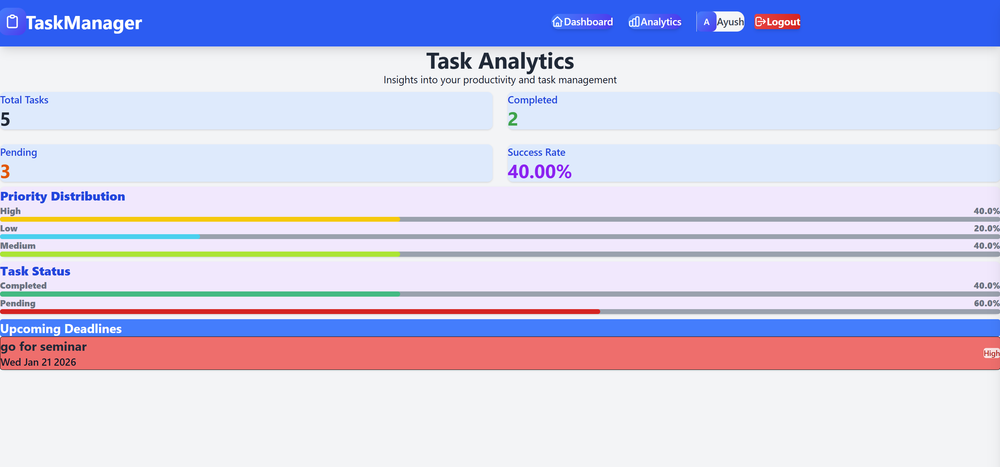

# 🎯 Smart Task Management System

A full-stack MERN application for efficient task management with user authentication, advanced filtering, and analytics dashboard.

## Project URLs
Frontend:
https://smart-task-mangement-app.vercel.app

Backend:
https://smart-task-mangement-app.onrender.com

GitHub Repository:
https://github.com/itsmeayush26/Smart-Task-Mangement-App

## 📋 Table of Contents
- [Features](#features)
- [Tech Stack](#tech-stack)
- [Project Structure](#project-structure)
- [Installation](#installation)
- [Environment Variables](#environment-variables)
- [API Documentation](#api-documentation)
- [Deployment](#deployment)
- [Screenshots](#screenshots)

## ✨ Features

### Authentication & Security
- ✅ Secure user registration with bcrypt password hashing
- ✅ JWT-based authentication
- ✅ Protected routes and API endpoints
- ✅ User-specific task isolation

### Task Management
- ✅ Create, Read, Update, Delete (CRUD) operations
- ✅ Task priority levels (High, Medium, Low)
- ✅ Task status tracking (Pending, Completed)
- ✅ Due date management
- ✅ Mark tasks as complete/incomplete

### Advanced Features
- ✅ Search tasks by title or description
- ✅ Filter by status and priority
- ✅ Sort by due date and priority
- ✅ Real-time UI updates
- ✅ Responsive design (Mobile + Desktop)

### Analytics Dashboard
- ✅ Total tasks count
- ✅ Completion rate calculation
- ✅ Priority distribution charts
- ✅ Status distribution
- ✅ Upcoming deadlines (7-day forecast)
- ✅ MongoDB aggregation pipeline

## 🛠️ Tech Stack

### Backend
- **Node.js** - Runtime environment
- **Express.js** - Web framework
- **MongoDB** - NoSQL database
- **Mongoose** - ODM for MongoDB
- **JWT** - Authentication
- **bcryptjs** - Password hashing

### Frontend
- **React.js** - UI library
- **Vite** - Build tool
- **Tailwind CSS** - Styling
- **Axios** - HTTP client
- **React Router** - Navigation

## 📁 Project Structure

```
smart-task-management/
├── backend/
│   ├── config/
│   │   └── jwt.js
│   ├── controllers/
│   │   ├── authController.js
│   │   └── taskController.js
│   ├── middleware/
│   │   └── auth.js
│   ├── models/
│   │   ├── User.js
│   │   └── Task.js
│   ├── routes/
│   │   ├── authRoutes.js
│   │   └── taskRoutes.js
│   ├── .env
│   ├── server.js
│   └── package.json
│
├── frontend/
│   ├── src/
│   │   ├── components/
│   │   │   ├── Navbar.jsx
│   │   │   └── ProtectedRoute.jsx
│   │   ├── context/
│   │   │   └── AuthContext.jsx
│   │   ├── pages/
│   │   │   ├── Register.jsx
│   │   │   ├── Login.jsx
│   │   │   ├── Dashboard.jsx
│   │   │   ├── TaskForm.jsx
│   │   │   └── Analytics.jsx
│   │   ├── utils/
│   │   │   └── axios.js
│   │   ├── App.jsx
│   │   ├── main.jsx
│   │   └── index.css
│   ├── .env
│   ├── package.json
│   ├── tailwind.config.js
│   └── vite.config.js
│
└── README.md
```

## 🚀 Installation

### Prerequisites
- Node.js (v16 or higher)
- MongoDB Atlas account or local MongoDB
- Git

### Backend Setup

1. Clone the repository
```bash
git clone <your-repo-url>
cd smart-task-management/backend
```

2. Install dependencies
```bash
npm install
```

3. Create `.env` file
```bash
cp .env.example .env
```

4. Configure environment variables (see [Environment Variables](#environment-variables))

5. Start the server
```bash
# Development
npm run dev

# Production
npm start
```

Server will run on `http://localhost:5000`

### Frontend Setup

1. Navigate to frontend directory
```bash
cd ../frontend
```

2. Install dependencies
```bash
npm install
```

3. Create `.env` file
```bash
cp .env.example .env
```

4. Start development server
```bash
npm run dev
```

Frontend will run on `http://localhost:5173`

## 🔐 Environment Variables

### Backend (.env)
```env
PORT=5000
NODE_ENV=development
MONGODB_URI=<....your_mongo_url>
JWT_SECRET=your_super_secret_jwt_key_change_in_production
JWT_EXPIRE=7d
CLIENT_URL=http://localhost:5173
```

### Frontend (.env)
```env
VITE_API_URL=http://localhost:5000/api
```

## 📚 API Documentation

### Base URL
```
http://localhost:5000/api
```

### Authentication Endpoints

#### Register User
```http
POST /auth/register
Content-Type: application/json

{
  "fullName": "John Doe",
  "email": "john@example.com",
  "password": "password123"
}
```

**Response:**
```json
{
  "success": true,
  "message": "User registered successfully",
  "data": {
    "userId": "65f1a2b3c4d5e6f7g8h9i0j1",
    "fullName": "John Doe",
    "email": "john@example.com",
    "token": "eyJhbGciOiJIUzI1NiIsInR5cCI6IkpXVCJ9..."
  }
}
```

#### Login User
```http
POST /auth/login
Content-Type: application/json

{
  "email": "john@example.com",
  "password": "password123"
}
```

#### Get User Profile
```http
GET /auth/profile
Authorization: Bearer <token>
```

### Task Endpoints (All Protected)

#### Create Task
```http
POST /tasks
Authorization: Bearer <token>
Content-Type: application/json

{
  "title": "Complete Project",
  "description": "Finish the MERN stack project",
  "dueDate": "2024-12-31",
  "priority": "High"
}
```

#### Get All Tasks (with filters)
```http
GET /tasks?search=project&status=Pending&priority=High&sortBy=dueDate
Authorization: Bearer <token>
```

**Query Parameters:**
- `search` - Search in title/description
- `status` - Filter by status (Pending/Completed)
- `priority` - Filter by priority (High/Medium/Low)
- `sortBy` - Sort by dueDate or priority

#### Get Single Task
```http
GET /tasks/:id
Authorization: Bearer <token>
```

#### Update Task
```http
PUT /tasks/:id
Authorization: Bearer <token>
Content-Type: application/json

{
  "title": "Updated Title",
  "status": "Completed"
}
```

#### Delete Task
```http
DELETE /tasks/:id
Authorization: Bearer <token>
```

#### Get Analytics
```http
GET /tasks/analytics/dashboard
Authorization: Bearer <token>
```

**Response:**
```json
{
  "success": true,
  "data": {
    "totalTasks": 15,
    "completedTasks": 8,
    "pendingTasks": 7,
    "completionRate": "53.33",
    "priorityDistribution": [
      { "_id": "High", "count": 5 },
      { "_id": "Medium", "count": 6 },
      { "_id": "Low", "count": 4 }
    ],
    "statusDistribution": [
      { "_id": "Completed", "count": 8 },
      { "_id": "Pending", "count": 7 }
    ],
    "upcomingDeadlines": [...]
  }
}
```

## 🌐 Deployment

### Backend Deployment (Render)

#### Render
1. Create account on [Render](https://render.com)
2. New Web Service
3. Connect GitHub repository
4. Configure:
   - Build Command: `npm install`
   - Start Command: `npm start`
5. Add environment variables
6. Deploy

### Frontend Deployment (Vercel)

1. Create account on [Vercel](https://vercel.com)
2. Import project from GitHub
3. Configure:
   - Framework Preset: Vite
   - Root Directory: `frontend`
4. Add environment variables:
   - `VITE_API_URL=<your-backend-url>/api`
5. Deploy

### Deployment URLs
- **Backend:** `https://smart-task-mangement-app.onrender.com`
- **Frontend:** `https://smart-task-mangement-app.vercel.app`
- **GitHub:** `https://github.com/itsmeayush26/Smart-Task-Mangement-App`

## 📦 Postman Collection

Import the Postman collection to test all API endpoints:

1. Open Postman
2. Click Import
3. Import the `Task_Manager.postman_collection.json` file
4. Set environment variables:
   - `base_url`: Your API URL
   - `token`: JWT token from login/register

### Collection Structure
```
Smart Task Management API
├── Auth
│   ├── Register
│   ├── Login
│   └── Get Profile
└── Tasks
    ├── Create Task
    ├── Get All Tasks
    ├── Get Task by ID
    ├── Update Task
    ├── Delete Task
    └── Get Analytics
```

## 🔒 Security Features

1. **Password Encryption**: bcrypt with salt rounds
2. **JWT Authentication**: Secure token-based auth
3. **Protected Routes**: Middleware authentication
4. **User Isolation**: Users can only access their own tasks
5. **Input Validation**: Mongoose schema validation
6. **XSS Protection**: React's built-in XSS protection
7. **CORS Configuration**: Controlled cross-origin requests

## 🎨 UI Features

- **Responsive Design**: Works on all devices
- **Clean Interface**: Minimal and intuitive
- **Real-time Updates**: Immediate feedback on actions
- **Loading States**: Spinner animations
- **Error Handling**: User-friendly error messages
- **Color-coded Priorities**: Visual task prioritization

## 📝 Testing

### Manual Testing Checklist

**Authentication:**
- [ ] Register new user
- [ ] Login with credentials
- [ ] Invalid login handling
- [ ] Protected route access
- [ ] Token expiration handling

**Task Management:**
- [ ] Create new task
- [ ] View all tasks
- [ ] Edit task
- [ ] Delete task
- [ ] Mark as complete/incomplete

**Filtering & Search:**
- [ ] Search by title
- [ ] Filter by status
- [ ] Filter by priority
- [ ] Sort by due date
- [ ] Combined filters

**Analytics:**
- [ ] View total tasks
- [ ] Check completion rate
- [ ] Priority distribution
- [ ] Upcoming deadlines

## 🤝 Contributing

1. Fork the repository
2. Create feature branch (`git checkout -b feature/AmazingFeature`)
3. Commit changes (`git commit -m 'Add AmazingFeature'`)
4. Push to branch (`git push origin feature/AmazingFeature`)
5. Open Pull Request

## 📄 License

This project is licensed under the MIT License.

## 👨‍💻 Author

**Your Name**
- GitHub: []
- Email: your.email@example.com

## 🙏 Acknowledgments

- MongoDB documentation
- Express.js documentation
- React documentation
- Tailwind CSS
- JWT.io

## screenshots of app





**Note:** This project is created for academic purposes and portfolio demonstration. Feel free to use it as a learning resource or template for your own projects.